# 🛡️ OnuronOS Threat Model & Security Architecture

Complies with **Roadmap Section 35** and **ADR-0001 through ADR-0009**.

This living document formalizes the threat landscape, trust boundaries, fail-closed enforcement rules, assets, attacker profiles, and security disclosure policies of OnuronOS.

---

## 1. Assets and Security Objectives

| Asset | Description | Primary Security Objective | Mitigations |
|---|---|---|---|
| **Root of Trust (RoT)** | Kernel, `nilinit` (PID 1), and base system images | **Integrity & Authenticity** | Cryptographic Verified Boot (AVB/dm-verity), read-only rootfs, immutable CIL SELinux policy |
| **System Signing Keys** | Ed25519 OS release & OTA publisher keys | **Confidentiality & Provenance** | Pinned trust store, offline key ceremonies, hardware security modules (HSM) / protected CI |
| **User Data & Encryption** | `/data/user/<uid>` personal files, SMS, contacts, credentials | **Confidentiality & Integrity** | Linux `fscrypt v2` (AES-256-XTS), TEE-backed master keys, runtime memory eviction by `nilkeyd` |
| **Hardware Capabilities** | Camera, microphone, cellular radio, GPS, Bluetooth | **Authorization & Least Privilege** | Capability brokering through `nilrt` permission broker, no raw evdev or V4L2 access for apps |
| **Inter-Process IPC** | Unix domain sockets under `/run/nilos/` and `/run/onuron/` | **Message Authenticity & Isolation** | Length-prefixed versioned framing (`ONUR` magic, 1 MiB cap), peer UID/GID credential verification |
| **Application Runtime** | Native `.nilax` applications executing inside `nilrt` | **Containment & Non-Interference** | Linux namespaces (PID, Mount, Net, IPC), seccomp-BPF (~110 syscall allowlist), MCS isolation |
| **Host Bridge (Track B)** | JNI bridge to Android host OS (Samsung Galaxy S25) | **Input Sanitization & Boundary Defense** | Strict JSON framing, bounded queues (1024), length caps (1 MiB), phone number redaction in logs |

---

## 2. Attacker Profiles & Capabilities

We consider the following attacker models within our security posture:

1. **Malicious Application Author (Untrusted `.nilax` Package)**:
   - *Capabilities*: Packages arbitrary NilLang bytecode or native binaries attempting privilege escalation, local data exfiltration, or denial-of-service loops.
   - *Mitigations*: Unsigned or untrusted packages are rejected at installation (`nilpkg`). Sandboxing (`nilrt`) strips root capabilities, restricts namespaces, enforces seccomp syscall filters, and confines execution to unprivileged UIDs.

2. **Network Attacker (Adjacent / Remote)**:
   - *Capabilities*: Man-in-the-middle (MITM) on wireless links, rogue Wi-Fi access points, spoofed mDNS SoftBus announcements.
   - *Mitigations*: All network daemons drop raw socket creation privileges. SoftBus enforces mutual TLS 1.3 / QUIC encryption with explicit user pairing verification. Zero network diagnostics call-homes (Zero-Telemetry charter).

3. **Compromised Host / Interrupted Device (Physical / Fastboot Access)**:
   - *Capabilities*: Attacker connects USB to fastboot/EDL or modifies device partition storage offline.
   - *Mitigations*: Verified boot hash trees (dm-verity), rollback protection indices in `UpdateManifest` and `SlotMeta`, fastboot hardware gates in `flash-device.sh` blocking incompatible target flashing, encrypted userdata with user PIN-derived fscrypt v2 keys.

4. **Malicious IPC Client (Local Rogue Daemon / Forked Child)**:
   - *Capabilities*: Injects malformed frames, oversized buffers, or spoofed commands to system daemons (`powerd`, `audiod`, `telephonyd`).
   - *Mitigations*: Canonical framed IPC (`nilprotocol`) validates `ONUR` magic preamble, rejects frames exceeding 1 MiB, validates message type enum bounds, and enforces peer credential checks.

---

## 3. Trust Boundaries

```mermaid
graph TB
    subgraph Ring0 ["Firmware & Kernel Boundary"]
        Bootloader["Verified Bootloader / AVB"]
        Kernel["Linux LTS Kernel (SELinux Enforcing)"]
    end

    subgraph Ring1 ["System Supervision Layer (Root / PID 1)"]
        Init["nilinit (PID 1)"]
        Daemons["Supervised Daemons\n(powerd, audiod, netd, telephonyd, nilupd)"]
    end

    subgraph Ring2 ["Application Runtime Sandbox"]
        NilRT["nilrt Container Engine"]
        PermBroker["Permission Broker (permbroker)"]
        Apps["Untrusted .nilax Apps\n(Namespaces + Seccomp-BPF + MCS)"]
    end

    subgraph Ring3 ["Host Integration Boundary (Track B - S25)"]
        JNI["libandroid_host.so JNI Export"]
        AndroidFramework["Android OS Framework\n(Telecom, Camera2, AudioTrack)"]
    end

    Bootloader -->|AVB Root Hash| Kernel
    Kernel -->|Executes| Init
    Init -->|Fork / Supervise| Daemons
    Daemons -->|Framed IPC /run/nilos/| PermBroker
    PermBroker -->|Brokered Access| NilRT
    NilRT -->|Confines| Apps
    JNI <-->|Bounded Queues & Redacted Logs| AndroidFramework
```

### Critical Boundary Crossings:
1. **Bootloader / Kernel ↔ `nilinit`**: Bootloader verifies vbmeta root hashes; kernel mounts read-only system partition and hands execution to PID 1.
2. **`nilinit` ↔ System Daemons**: `nilinit` drops root privileges per daemon where applicable, applies cgroup resource limits, and supervises socket-activated endpoints.
3. **Privileged Daemons ↔ Applications**: Applications never access hardware devices directly (`/dev/*`). All hardware access is requested via typed IPC through `nilrt`'s `permbroker`.
4. **Package Manager (`nilpkg`) ↔ Publisher Store**: Only packages signed by keys in `<key_dir>/trusted/` that are not listed in `<key_dir>/revoked/` are unpacked.
5. **Guest Runtime ↔ Android JNI Bridge**: The JNI interface sanitizes all parameters, enforces input bounds, validates UTF-8 strings, and prevents unhandled panics from bubbling across FFI boundaries.

---

## 4. Fail-Closed Invariant Matrix

Under no circumstances may a security check fail open. The following invariants are strictly enforced:

| Failure Condition | Expected Fail-Closed Behavior | Code Enforcement Point |
|---|---|---|
| **Package Signature Mismatch** | Package installation immediately halted; temporary staging deleted. | `nilpkg::extract` & `nilpkg::verify_signature` |
| **Untrusted Publisher Key** | Installation refused with structured `UntrustedPublisher` error. | `nilpkg::keymgmt::trusted_publisher` |
| **Path Traversal in Archive** | Unpack aborted if archive contains `..`, absolute paths, or symlinks escaping destination root. | `nilpkg::extract::safe_extract_archive` |
| **Seccomp Filter Setup Failure** | Process launch fails immediately; child never executes without active filter. | `nilrt::seccomp::enforce_strict_filter` |
| **Namespace Isolation Failure** | Application launch aborts; unconfined execution is forbidden. | `nilrt::sandbox::spawn_sandboxed` |
| **Oversized IPC Payload (> 1 MiB)** | Frame immediately rejected with `IpcError::PayloadTooLarge`; socket connection dropped. | `protocol::Frame::read_from` |
| **Unauthorized Hardware Flashing** | Flasher halts with security error; zero disk writes made. | `build/flash-device.sh` & `flash-device.ps1` |
| **Missing / Invalid VBMeta** | Hardware flashing rejected unless expert lab override explicitly asserted. | `build/flash-device.sh` (`SECURITY GATE`) |
| **OTA Downgrade Attack** | Update rejected if manifest `rollback_index` is lower than running image index. | `nilupd::anti_rollback_protection` |
| **Undersized Framebuffer Destination** | JNI copy returns 0 without copying partial distorted pixels to surface. | `android-host::jni_bridge::copy_latest_frame_to_slice` |
| **Missing Camera Hardware** | Strict capture returns `HalError::BackendUnavailable`; never returns fake photo as real capture. | `android-host::camera::capture_real_frame_strict` |

---

## 5. Security CI & Supply-Chain Integrity

The repository integrates automated security validation into GitHub Actions:
- **`cargo audit`**: Detects known RustSec vulnerabilities across all workspace dependencies.
- **Reproducible Build Verification**: `build/check-reproducible.py` validates that build scripts generate deterministic hashes.
- **SELinux Neverallow Scanner**: `build/test_selinux_audit.py` validates that CIL policies never permit raw hardware access from unprivileged domains.
- **Flasher Preflight Safety Tests**: `build/test_flasher_preflight.py` verifies zero-write behavior on dry-runs, target mismatches, and missing vbmeta descriptors.

---

## 6. Vulnerability Disclosure & Response Policy

1. **Private Reporting**: Security vulnerabilities should be reported privately to `security@onuron.org` (or GitHub Security Advisories) before public disclosure.
2. **Triaging SLA**: Critical privilege escalation, cryptographic bypass, or sandbox escape reports are triaged within **48 hours**.
3. **Patch & Release Policy**: Security fixes are backported to supported release branches with regression unit tests proving the vulnerability cannot recur.
4. **Key Compromise Emergency Protocol**:
   - Compromised publisher keys are immediately added to the on-disk `<key_dir>/revoked/` list.
   - An emergency signed OTA update with incremented `rollback_index` is distributed to invalidate the compromised chain.
